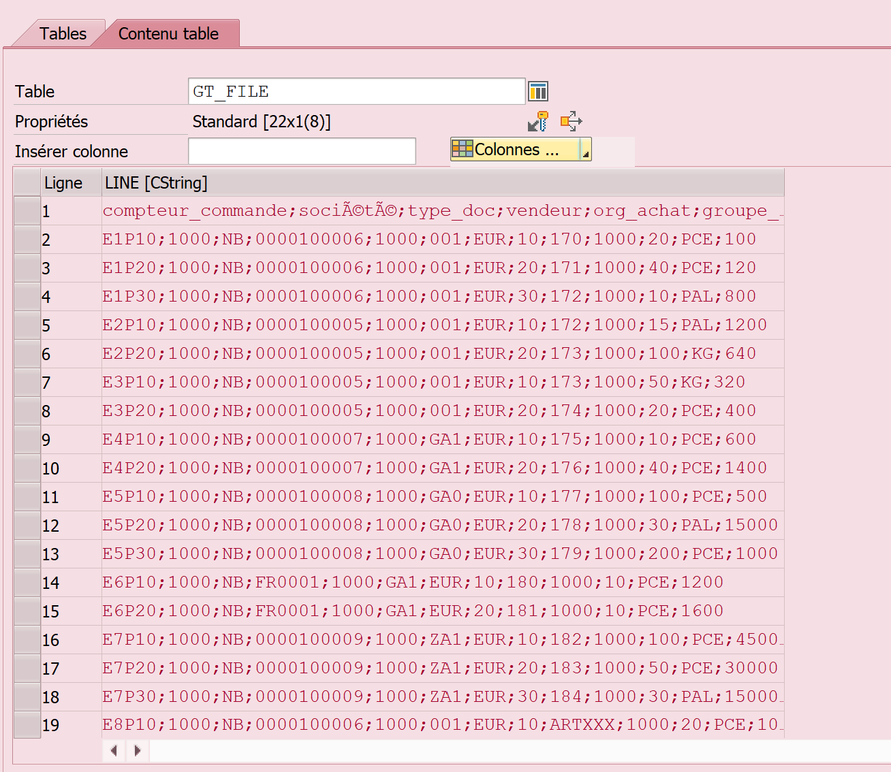
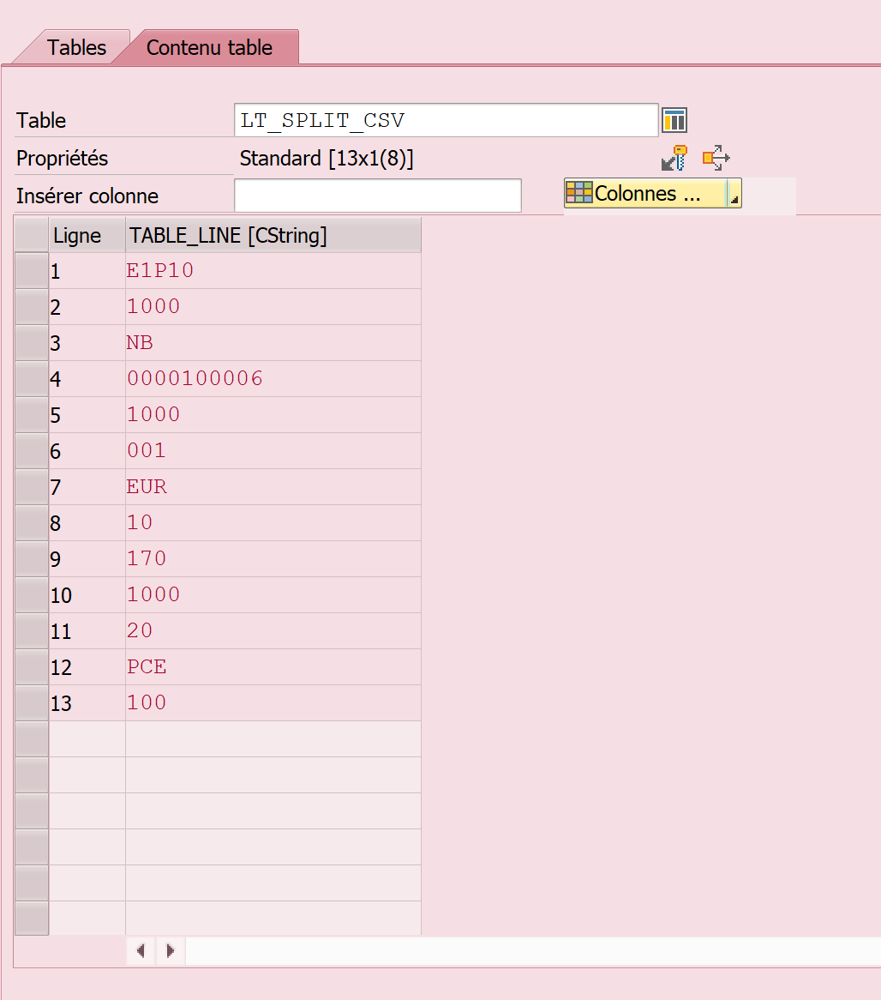
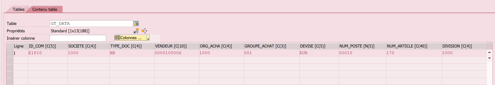
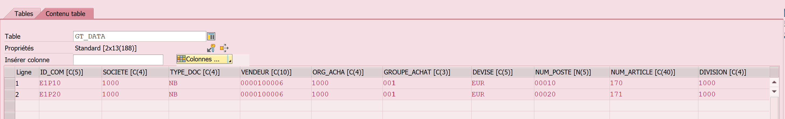

# BAPI: *Récupérer les lignes d'un document pour insérer dans une table*

AT SELECTION SCREEN ON VALUE REQUEST FOR : Pour pouvoir insérer un document quand on clique sur le matchcode.

```ABAP
AT SELECTION-SCREEN ON VALUE-REQUEST FOR p_fname.

  IF p_rad1 IS NOT INITIAL.
    CALL FUNCTION 'F4_FILENAME'
      EXPORTING
        program_name  = syst-cprog
        dynpro_number = syst-dynnr
        field_name    = 'P_FNAME'
      IMPORTING
        file_name     = p_fname.
  ENDIF.
```

DANS LE SCREEN, Mettre un radiobutton

```ABAP
" Traitement Création de Commande d'achat en masse via la BAPI_PO_CREATE
PARAMETERS : p_crea  TYPE xfeld RADIOBUTTON GROUP rb1 USER-COMMAND trait DEFAULT 'X'.

" Bloc de paramètres relatif au traitement création de commande
SELECTION-SCREEN BEGIN OF BLOCK b1 WITH FRAME TITLE TEXT-002.

PARAMETERS: p_rad1  RADIOBUTTON GROUP rb2 USER-COMMAND fcode MODIF ID g1 DEFAULT 'X',
            p_fname TYPE localfile MODIF ID g1. "Chemin du fichier local

SELECTION-SCREEN SKIP 1.
PARAMETERS: p_rad2       RADIOBUTTON GROUP rb2 MODIF ID g1,
            p_lpath(500) TYPE c MODIF ID g1,  " Chemin logique
            p_lname(100) TYPE c MODIF ID g1,  " Nom du fichier
            p_arch(500)  TYPE c MODIF ID g1.  " Chemin logique pour archivage des fichiers . csv

SELECTION-SCREEN END OF BLOCK b1.
```
Dans le programme principal : 

```ABAP
ELSEIF p_crea = 'X'.

    PERFORM get_data_from_file. " Récupération des données contenues dans le fichier dans une table string

    PERFORM prepare_data.       " Formatage et stockage des données dans des tables internes


    PERFORM create_po.          " Création des commandes d'achat à partir des tables internes précédemment alimentées

*    PERFORM log.
*
*    PERFORM write_po.           " Création d'un protocole pour afficher les PO créées?
  ENDIF.
```

- Le get_data_from_file va mettre les infos du fichier dans une ligne :

```ABAP
FORM get_data_from_file .

  DATA: lv_filename TYPE string.

  lv_filename = p_fname.

  CALL FUNCTION 'GUI_UPLOAD'
    EXPORTING
      filename                = lv_filename
      filetype                = 'ASC'
    TABLES
      data_tab                = gt_file
    EXCEPTIONS
      file_open_error         = 1
      file_read_error         = 2
      no_batch                = 3
      gui_refuse_filetransfer = 4
      invalid_type            = 5
      no_authority            = 6
      unknown_error           = 7
      bad_data_format         = 8
      header_not_allowed      = 9
      separator_not_allowed   = 10
      header_too_long         = 11
      unknown_dp_error        = 12
      access_denied           = 13
      dp_out_of_memory        = 14
      disk_full               = 15
      dp_timeout              = 16
      OTHERS                  = 17.
  IF sy-subrc <> 0.
*    FREE: gt_file.
*    MESSAGE e013(zkde).
  ENDIF.

ENDFORM.
```



-Dans prepare_data, on va séparer la ligne créée avec le get_data en assignant un field-symbol et avec SPLIT.

On supprime la ligne 1 car c'est la ligne des titres des colonnes.

On crée une nouvelle table (ici lt_split_csv) qui va trier les données dans différentes lignes

Le loop fait qu'il va remplir la table avec toutes les lignes du get_data

```ABAP
FORM prepare_data .


  DELETE gt_file INDEX 1.

  LOOP AT gt_file ASSIGNING FIELD-SYMBOL(<fs_file>).
    SPLIT <fs_file>-line AT ';' INTO TABLE DATA(lt_split_csv).

    IF lt_split_csv IS NOT INITIAL.
      APPEND INITIAL LINE TO gt_data ASSIGNING FIELD-SYMBOL(<fs_data>).

      IF <fs_data> IS ASSIGNED.
        <fs_data>-id_com  = lt_split_csv[ 1 ].
        <fs_data>-societe  = lt_split_csv[ 2 ].
        <fs_data>-type_doc = lt_split_csv[ 3 ].
        <fs_data>-vendeur = lt_split_csv[ 4 ].
        <fs_data>-org_acha = lt_split_csv[ 5 ].
        <fs_data>-groupe_achat = lt_split_csv[ 6 ].
        <fs_data>-devise = lt_split_csv[ 7 ].
        <fs_data>-num_poste = lt_split_csv[ 8 ].
        <fs_data>-num_article = lt_split_csv[ 9 ].
        <fs_data>-division = lt_split_csv[ 10 ].
        <fs_data>-quantite_com = lt_split_csv[ 11 ].
        <fs_data>-unite_quantite = lt_split_csv[ 12 ].
        <fs_data>-prix_net = lt_split_csv[ 13 ].
      ENDIF.
    ENDIF.

  ENDLOOP.


ENDFORM.
```


Puis ça va ajouter dans la gt_data chaque ligne à chaque loop :



Etc...

											
- Puis une fois le loop terminé, on passe dans le CREATE_PO

```ABAP
FORM create_po .


  DATA : ls_header TYPE  bapimepoheader.
  DATA : ls_header_x TYPE  bapimepoheaderx.
  DATA : ls_item   TYPE bapimepoitem,
         ls_itemx  TYPE bapimepoitemx,
         lt_item   TYPE STANDARD TABLE OF bapimepoitem,
         lt_itemx  TYPE STANDARD TABLE OF bapimepoitemx,
         lt_return TYPE STANDARD TABLE OF bapiret2.
  DATA : lv_ponumber TYPE bapimepoheader-po_number.


LOOP AT gt_data ASSIGNING FIELD-SYMBOL(<fs_data>).

* Données d'en tête de la CA
    ls_header-comp_code  = <fs_data>-societe.
    ls_header-doc_type   =  <fs_data>-type_doc.
    ls_header-vendor     =  <fs_data>-vendeur.
    ls_header-purch_org  = <fs_data>-org_acha.
    ls_header-pur_group   = <fs_data>-groupe_achat.
    ls_header-currency   = <fs_data>-devise.

    ls_header_x-comp_code = 'X'.
    ls_header_x-doc_type = 'X'.
    ls_header_x-vendor   = 'X'.
    ls_header_x-purch_org = 'X'.
    ls_header_x-pur_group = 'X'.
    ls_header_x-currency = 'X'.

* Données des postes de la CA
    ls_item-po_item      =  <fs_data>-num_poste.
    ls_item-material     = <fs_data>-num_article.
    ls_item-plant        = <fs_data>-division.
    ls_item-quantity     =  <fs_data>-quantite_com.
    ls_item-po_unit      = <fs_data>-unite_quantite.
    ls_item-net_price    = <fs_data>-prix_net.


    ls_itemx-po_item   = <fs_data>-num_poste.
    ls_itemx-material  = 'X'.
    ls_itemx-plant     = 'X'.
    ls_itemx-quantity  = 'X'.
    ls_itemx-po_unit   = 'X'.
    ls_itemx-net_price = 'X'.

    APPEND ls_item TO lt_item.
    APPEND ls_itemx TO lt_itemx.

    CALL FUNCTION 'BAPI_PO_CREATE1'
      EXPORTING
        poheader         = ls_header      " Exporting
        poheaderx        = ls_header_x    " Exporting
      IMPORTING
        exppurchaseorder = lv_ponumber   " Importing
      TABLES
        return           = lt_return     " Importing
        poitem           = lt_item      " Exporting
        poitemx          = lt_itemx.     " Exporting

    LOOP AT lt_return ASSIGNING FIELD-SYMBOL(<fs_return>) WHERE type = 'E' OR type = 'A'.
      EXIT.
    ENDLOOP.
    IF sy-subrc <> 0.
      CALL FUNCTION 'BAPI_TRANSACTION_COMMIT'.

      MESSAGE s012(zkde) WITH lv_ponumber.
    ELSE.
      CALL FUNCTION 'BAPI_TRANSACTION_ROLLBACK'.
    ENDIF.

  ENDLOOP.


**--------------Envoi d'un compte rendu de l'opération par mail------------
*  DATA(lo_email) = NEW zcl_mail_kde( iv_type       = zcl_mail_kde=>c_type-htm
*                                     iv_importance = zcl_mail_kde=>c_prio-priorite_normale ).
*
*  lo_email->set_po_number( lv_ponumber ).
*  lo_email->set_return( lt_return ).
*
*  IF lo_email->launch( ) = abap_true.
*    MESSAGE 'Email envoyé' TYPE 'I'.
*  ELSE.
*    MESSAGE 'Email non envoyé' TYPE 'I'.
*    DATA(lt_messages) = lo_email->get_messages( ).
*  ENDIF.


ENDFORM.
```

