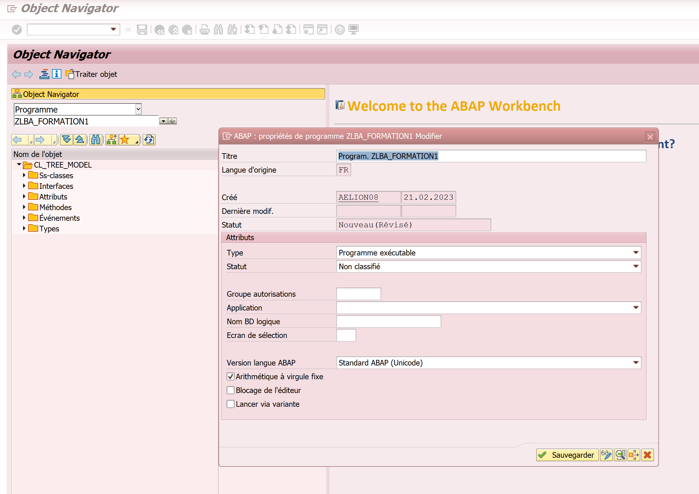
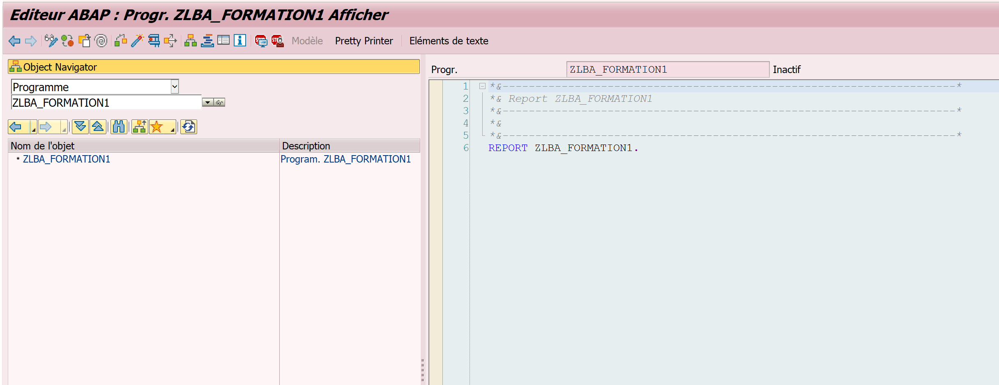
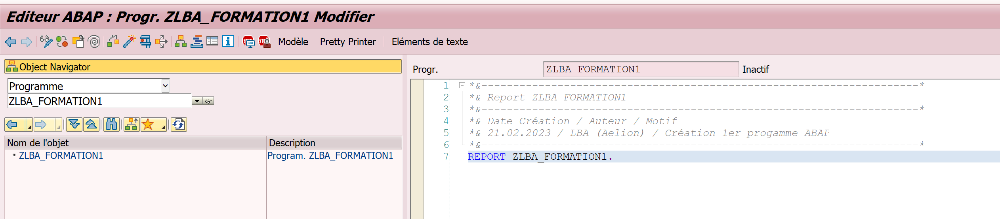
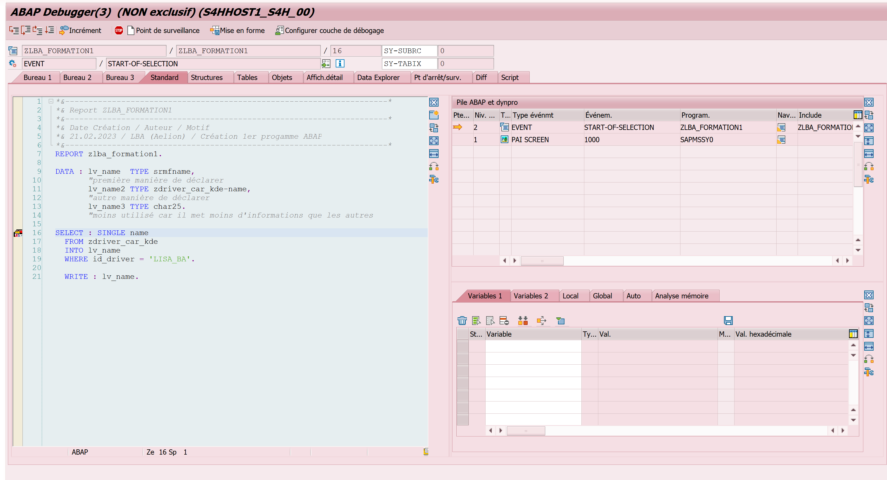
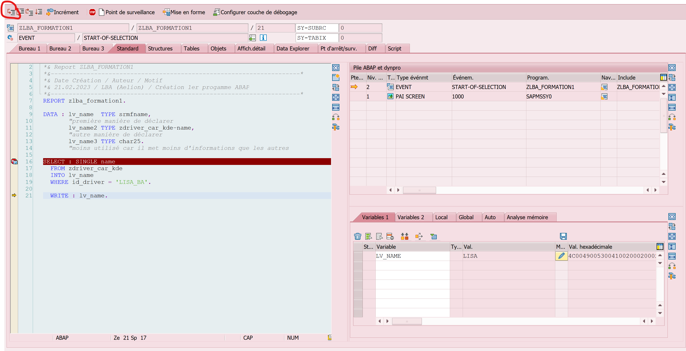
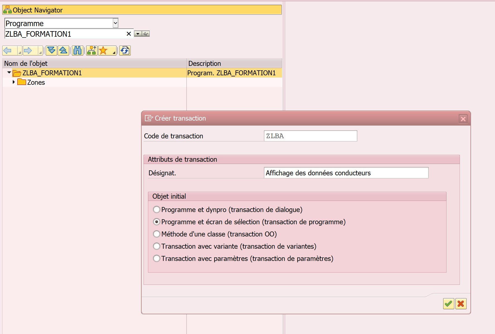
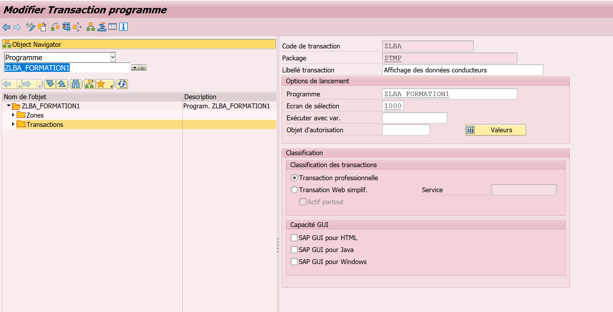
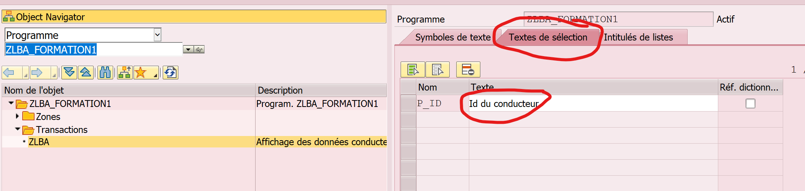
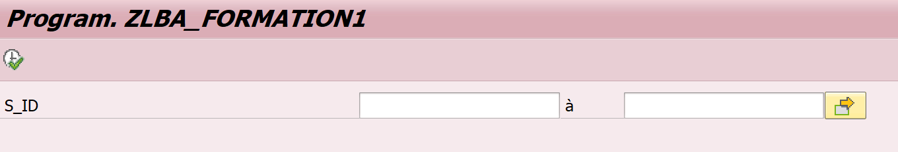

Pour une valeur on crée une variable

Pour une ligne on crée une structure

Pour toutes les lignes on crée une table

Pour créer un modèle qui va servir à créer des objets, on écrit TYPES : (attention avec un S)

On peut créer des domaines dans SE11 et on peut aussi mettre des valeurs obligatoires (onglet Pl.valeurs) et des éléments de données basée sur le domaine créé. 

Dans description zone on met le nom qu'on veut voir dans le titre de la colonne.


Une table interne est une table qui existe que dans le programme (qui n'est pas dans la table de données)
SI table créé dans SE11, elle est sur la base de donnée donc c'est une table externe

Ici nom du programme créé : ZLBA_FORMATION1



Programme exécutable = programme qui doit être lancé, à la différence de JOB qui est un programme qui se lance tout seul (par exemple pour la mise à jour du stock tous les jours à 7h)

Pour la formation, enregistrer en objet local car pas besoin de transporter le programme, sinon enregistrer en OT

Une fois le programme créé, on a 




Pour modifier, cliquer sur le stylo avec les lunettes

Ajouter dans le cartouche, la date, le nom et la raison de la création ou modifications pour le suivi



Création d'une variable, ici pour afficher le prénom dans la table "ZDRIVER..." :

```ABAP
DATA : lv_name  TYPE srmfname,
       première manière de déclarer
       lv_name2 TYPE zdriver_car_kde-name,
       autre manière de déclarer
       lv_name3 TYPE char25.
moins utilisé car il met moins d'informations que les autres
```

Pour renseigner le TYPE, on doit mettre le même qui a été renseigné lors de la création, pour savoir lequel c'est, il faut faire /OSE11, rechercher la table, et recopier le texte de "élément de données"

On peut remplacer TYPE par "ressemble à " pour lire la phrase à voix haute, à ne pas confondre avec TYPES avec un S, qui sert à créer un modèle.

Sélectionne mon prénom à partir de mon identifiant (car l'identifiant est la clé primaire) de la table  "ZDRIVER..." :

```ABAP
SELECT : SINGLE name
FROM zdriver_car_kde
INTO lv_name
WHERE id_driver = 'LISA_BA'.

WRITE : lv_name.
```

Dans DATA on a créé la variable et dans INTO on demande à ce que l'information recherché dans SELECT soit marqué dans la variable créée.
Cliquer sur la baguette pour l'activer.

Pour voir le code, on peut aussi utiliser l'outil de débugage :

Outil de débugage pour voir ce que va faire le programme pendant qu'on l'exécute, il faut que le code soit actif et dans la colonne de gauche en jaune, on clique et ça met un point d'arrêt dynamique qui permet de tester jusqu'à ce point. On peut programmer le temps du point d'arrêt pour qu'il reste qu'un certain temps
(On peut aussi mettre un point d'arrêt statique en écrivant BREAK-POINT mais il faut pas oublier de l'enlever à la fin de la programmation.)
Puis cliquer sur "direct"

Ca nous affiche :



Le code retour des instructions : SY-SUBRC doit être égal à 0 ca dit que le code a été correctement effectué (jusqu'au point d'arrêt)

Pour exécuter après le point d'arrêt, cliquer sur le 1er onglet en haut à gauche (F5) et il  exécute l'étape suivante. (chaque étape est terminée par un . )Donc ici jusqu'à WHRITE
Ensuite double cliq sur lv_name et ça doit afficher le nom sur le tableau variable de droite



Pour afficher la structure (càd toutes les informations contenues dans la ligne)
Dans le TYPE, on peut mettre le nom de la table comme ça il prend en compte toutes les caractéristiques.

```ABAP
DATA : ls_zdriver  TYPE zdriver_car_kde.

SELECT : SINGLE *
FROM zdriver_car_kde
INTO ls_zdriver
WHERE id_driver = 'LISA_BA'.

WRITE : ls_zdriver.
```

Récupération de l'ensemble des données de la table :
Pour écrire la table avec plusieurs ligne, il faut écrire entre LOOP et ENDLOOP : WRITE : ls_zdriver
Comme ça au lieu de remplacer chaque ligne, il les ajoute l'une en dessous de l'autre et ça nous crée une table

```ABAP
DATA : lt_zdriver  TYPE TABLE OF zdriver_car_kde,
DATA : ls_zdriver  TYPE zdriver_car_kde.

SELECT *
FROM zdriver_car_kde
INTO TABLE lt_zdriver.

SORT lt_zdriver BY name ASCENDING. "Pour trier la table

LOOP AT lt_zdriver INTO ls_zdriver
  WHERE car_brand = 'Peugeot' and ( name = 'OSCAR' or name = 'MAGALI' ).
  WRITE : ls_zdriver.
ENDLOOP.

*Autre exemple

LOOP AT lt_zdriver INTO ls_zdriver where car_brand =  'Peugeot'.
  WHERE car_brand = 'Peugeot'.
  IF ls_zdriver-name = 'OSCAR'.
    EXIT.
    ELSEIF ls_zdriver-name = 'MAGALI'.
      WRITE : ls_zdriver.
    ELSE.
       WRITE : 'Heureusement je n''ai pas de peugeot'.
  ENDIF.
```

On peut aussi faire IF et ENDIF

CONTINUE veut dire qu'on passe au tour suivant de la boucle et revient au début (donc là il ne fait pas le WRITE)

EXIT : fait sortir de la boucle et quitte

On peut trier la table avec SORT 

Pour enlever oscar de la liste avec CHECK :
(<> veut dire "différent de", on peut aussi mettre NE (NonEguaL))


```ABAP
LOOP AT lt_zdriver INTO ls_zdriver where car_brand =  'Peugeot'.
  WHERE car_brand = 'Peugeot'.
  IF ls_zdriver-name = 'OSCAR'.
    EXIT.
    ELSEIF ls_zdriver-name = 'MAGALI'.
      WRITE : ls_zdriver.
    ELSE.
       WRITE : 'Heureusement je n''ai pas de peugeot'.
  ENDIF.
  ```

  Quand on a plus de 2 conditions, on ne met pas un IF mais un CASE :

```ABAP
    CHECK ls_zdriver-name <> 'OSCAR'.
  CASE ls_zdriver-name.
    WHEN 'OSCAR'.
      CONTINUE.
    WHEN 'MAGALI'.
      WRITE : ls_zdriver.
    WHEN OTHERS.
      WRITE : 'Je roule en Allemande'.
  ENDCASE.
  ```
Pour associer 2 résultats dans une ligne :

```ABAP
DATA : lv_fusion TYPE string.

LOOP AT lt_sdriver INTO ls_zdriver where car_brand = 'Peugeot'.
  CONCATENATE lv_fusion ls_zdriver-name into lv_fusion SEPARATED BY space.
* sur S/4 on peut faire : lv_fusion = |{ lv_fusion }{ ls_zdriver-name }|.

ENDLOOP.
WRITE lv_fusion "Affiche MAGALI OSCAR
  ```

Sur S/4 on peut faire : lv_fusion = |{ lv_fusion }{ ls_zdriver-name }|.

Ça permet aussi de faire des fusions avec des nombres alors que avec CONCATENATE on ne peut pas.

Pour créer un modèle (un squelette) qui va servir à créer des objets, on écrit TYPES : (attention avec un S, rien à voir avec TYPE)

Déclaration statique :

```ABAP
TYPES : BEGIN OF ty_zdriver,
        id_driver TYPE Z_DRIVER_ID_KDE,
        surname TYPE NAMEF,
        name TYPE SRMFNAME,
        date_birth TYPE P06_DATENAISS,
        END OF ty_zdriver.

DATA : lt_driver TYPE TABLE OF ty_zdriver.

SELECT id_driver surname name date_birth
  FROM zdriver_car_kde
  INTO TABLE  lt_driver.  "Ou INTO CORRESPONDING FIELDS OF TABLE
```
Quand on fait un SELECT, on doit nommer les objets dans le même ordre que dans TYPES, sinon on peut mettre INTO CORRESPONDINF FIELDS OF TABLE à la place de INTO TABLE, et il range le bon objet dans la bonne case à condition d'avoir bien écris les termes pareils (mais attention le programme sera plus long à s'exécuter)

Déclaration dynamique (marche que sur S/4):

```ABAP
SELECT id_driver, surname, name, date_birth
FROM zdriver_car_kde
  INTO TABLE @DATA(lt_driver)
```   

C'est la même que la statique mais en plus facile à coder car elle crée la table en même temps qu'on la déclare. Attention, là il faut mettre des virgules entre chaque select.

Pour faire afficher le tableau dans une ALV, remplacer juste le nom de la table par la table créée :

```ABAP
DATA : lo_alv TYPE REF TO cl_salv_table.

CALL METHOD cl_salv_table=>factory
  IMPORTING
    r_salv_table = lo_alv
  CHANGING
    t_table      = lt_driver.

CALL METHOD lo_alv->display.
```

Pour créer une transaction, cliq droit sur le dossier avec le nom du programme, faire créer, transaction, donner un code à la transaction et sélectionner "programme et écran..." :



Valider puis mettre le nom du programme et disquette:



Le dossier transaction s'ajoute à la liste.

Il faut ensuite rentrer les paramètres d'affichage client :

PARAMETERS : p_id TYPE Z_DRIVER_ID_KDE.



Quand on met SELECT-OPTIONS avec FOR, il faut ajouter au-dessus TABLES : nom de la table
Le select option permet d'avoir plusieurs options de sélection pour l'utilisateur alors que PARAMETERS laisse qu'un choix (Avec PARAMETERS, pas besoin d'écrire TABLES...)

Pour ajouter des paramètres de sélection, on peut faire :

```ABAP
TABLES : zdriver_car_kde. "A mettre à cause du select option

*PARAMETERS : p_id TYPE z_driver_id_kde.
SELECT-OPTIONS : s_id FOR zdriver_car_kde-id_driver.


SELECT id_driver, surname, name, date_birth
FROM zdriver_car_kde
  INTO TABLE @DATA(lt_driver)
*WHERE id_driver = @p_id.
  WHERE id_driver IN @s_id.
```

RESULTAT : 



Pour utiliser la table mais pas la modifier on utilise USING et on la renomme ut_ au lieu de lt_

Quand on se base sur un modèle de ligne il faut marquer TYPE TABLE OF
Et si c'est sur un modèle de table c'est TYPE et ty_t_***
Table créé précédemment dans un TYPES

On peut aussi créer le type de table sur SE11 mais c'est utilisable par tout le monde et pas seulement dans le programme.