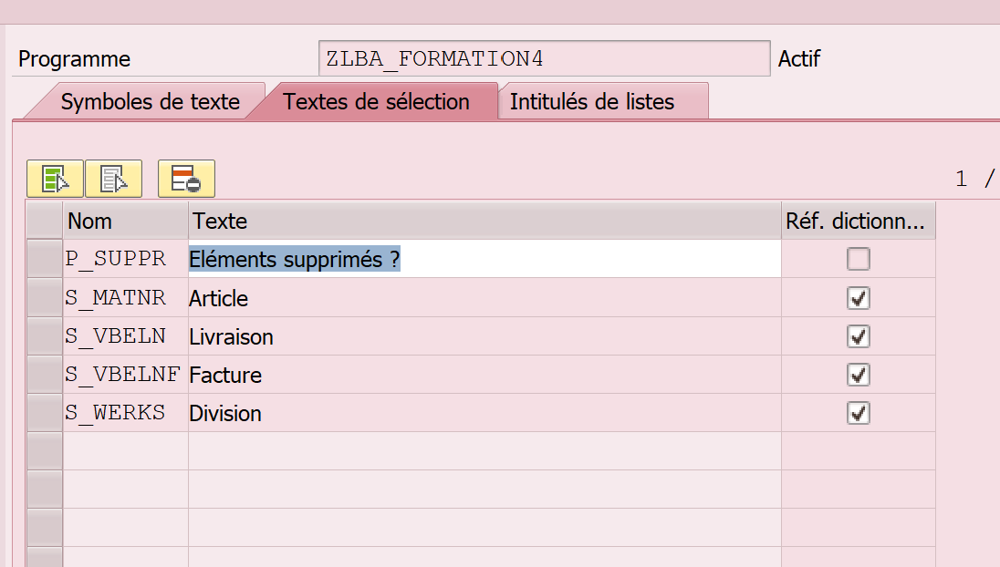
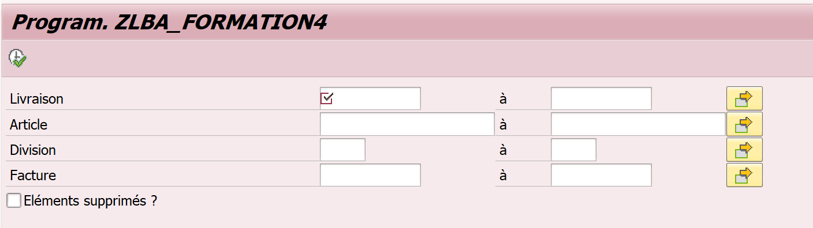

VOIR PROGRAMME DE KEVIN : ZKDE_CORR_EXO2

1-  On crée le programme

2- Dans le sommaire, on crée les includes pour structurer le programme.
		1er : include top pour les déclarations de varbiable globales car c'est-ce qu'il lit en 1er "top"
		2eme : déclaration critères de sélections de l'écran : le screan "scr"
		3eme : routine (ou perform) pour le traitement, nommé "F01"
		
On double cliq sur le nom de l'include pour le créer. Il va reconnaitre que c'est un include, et sauvegarder. Il va créer automatiquement le tiroir. Faire de même pour les 2 autres.

Pour activer, on doit activer tous les tiroirs en même temps pour qu'il les reconnaisse.

```ABAP
REPORT ZLBA_FORMATION4.

INCLUDE zlba_formation4_top. "Déclaration de mes variables globales
INCLUDE zlba_formation4_scr. "SCREEN Déclaration de notre écran de sélection
INCLUDE zlba_formation4_f01. "Traitements effectués sur les données (sélection de données, affichage des données...)

START-OF-SELECTION.

PERFORM select_data.

end-OF-SELECTION.
```

3- On va créer des modèles de tables  dans TOP qui vont permettre de récupérer les données.
Avec types, on crée des modèles de lignes. Ca va récupérer les infos mais ça n'a pas de rapport avec l'affichage de la table finale.

```ABAP
TYPES : BEGIN OF ty_likp,
          vbeln TYPE likp-vbeln,
          vstel  TYPE likp-vstel,
          vkorg  TYPE likp-vkorg,
          erdat  TYPE likp-erdat,
        END OF ty_likp.
```

4- Ici on a créé la table finale dans SE11 (elle sera visible et utilisable par tout le monde, elle n'est pas créée que pour la lecture du programme)

5- On met le Perform dans le sommaires (perform veut dire, va lire la "form")
On double clique sur select_data pour qu'il nous crée la form dans F01.

6- Dans le Form, on fait nos déclarations de table
FORM select_data .

```ABAP
  DATA : lt_likp TYPE TABLE OF ty_likp,
         lt_lips TYPE TABLE OF ty_lips,
         lt_vbrp TYPE TABLE OF ty_vbrp,
         lt_vbrk TYPE TABLE OF ty_vbrk,
         lt_marc TYPE TABLE OF ty_marc.
```

7- On rempli le screan pour les paramètres d'affichage :

```ABAP
select-options : s_vbeln for likp-vbeln obligatory.
select-options : s_matnr for lips-matnr.
select-options : s_werks for lips-werks.
select-options : s_vbelnf for vbrk-vbeln.


PARAMETERS : p_suppr  AS CHECKBOX.
```

Quand on a un FOR, donc un select option, on doit déclarer les tables avant (donc on peut le mettre dans TOP qui sera lu avant ) :

```ABAP
TABLES : likp, lips, vbrk.
```

8- On peut renommer les textes pour l'affichage dans éléments de textes.





9- On fait les select dans F01 pour chercher les infos.
Dans le WHERE, on fait la liaison avec les clés, si plusieurs clés mettre AND
Quand il s'agit des clés on met un =
Quand il s'agit d'un critère de sélection on met un "IN".

```ABAP
 SELECT vbeln vstel vkorg erdat
    FROM likp
    INTO TABLE lt_likp
    WHERE vbeln IN s_vbeln.

  SELECT vbeln posnr matnr werks lfimg meins
    FROM lips
    INTO TABLE lt_lips
    FOR ALL ENTRIES IN lt_likp
    WHERE vbeln = lt_likp-vbeln
    AND matnr IN s_matnr
    AND werks IN s_werks.


  SELECT vbeln vgbel vgpos posnr fkimg vrkme ntgew gewei netwr
     FROM vbrp
    INTO TABLE lt_vbrp
    FOR ALL ENTRIES IN lt_lips
   WHERE vgbel = lt_lips-vbeln
    AND vgpos = lt_lips-posnr.
```
			…

10- Perform merge_data : pour fusionner les données

On va utiliser les tableaux créés dans le select en mettant USING :

```ABAP
  PERFORM merge_data USING lt_likp
                            lt_lips
                            lt_vbrk
                            lt_vbrp
                            lt_marc.
```

11- Puis créer le merge data en double cliq dessus, dans le même page pour qu'il se mette en dessous.

```ABAP
FORM merge_data  USING    ut_likp TYPE ty_t_likp
                          ut_lips TYPE ty_t_lips
                          ut_vbrk TYPE ty_t_vbrk
                          ut_vbrp TYPE ty_t_vbrp
                          ut_marc TYPE ty_t_marc.
```

Ajouter le type de table dans le TOP car sinon il ne reconnait pas dans le merge data

```ABAP
TYPES : BEGIN OF ty_likp,
          vbeln TYPE likp-vbeln,
          vstel  TYPE likp-vstel,
          vkorg  TYPE likp-vkorg,
          erdat  TYPE likp-erdat,
        END OF ty_likp,
        ty_t_likp TYPE TABLE OF ty_likp.
```				
				...
12- On va récupérer les données dans le merge data.
Il faut qu'on déclare une structure pour pouvoir insérer les données :

```ABAP
*Déclarer une stucture pour chaque table :
 DATA : lsfinal_2 LIKE LINE OF gt_final2,
         ls_likp   TYPE ty_likp,
         ls_lips   TYPE ty_lips,
         ls_vbrk   TYPE ty_vbrk,
         ls_vbrp   TYPE ty_vbrp,
         ls_marc   TYPE ty_marc.
```	

Quand on fait un 1er loop, il faut penser à vider la structure.
On va insérer les données dans la structure finale :

```ABAP
LOOP AT ut_likp INTO ls_likp.
    CLEAR lsfinal_2.
    lsfinal_2-vbeln = ls_likp-vbeln.
    lsfinal_2-vstel = ls_likp-vstel.
    lsfinal_2-vkorg = ls_likp-vkorg.
    lsfinal_2-erdat = ls_likp-erdat.
```	

Il faut faire un loop quand on a plusieurs informations à récupérer dans les clés (donc quand il y a plusieurs clés dans la table) et on fait le lien avec la clé similaire entre les 2 tables.

```ABAP
 LOOP AT ut_lips INTO ls_lips WHERE vbeln = ls_likp-vbeln.
      lsfinal_2-posnr = ls_lips-posnr.
      lsfinal_2-matnr = ls_lips-matnr.
      lsfinal_2-werks = ls_lips-werks.
      lsfinal_2-lfimg = ls_lips-lfimg.
      lsfinal_2-meins = ls_lips-meins.
```

