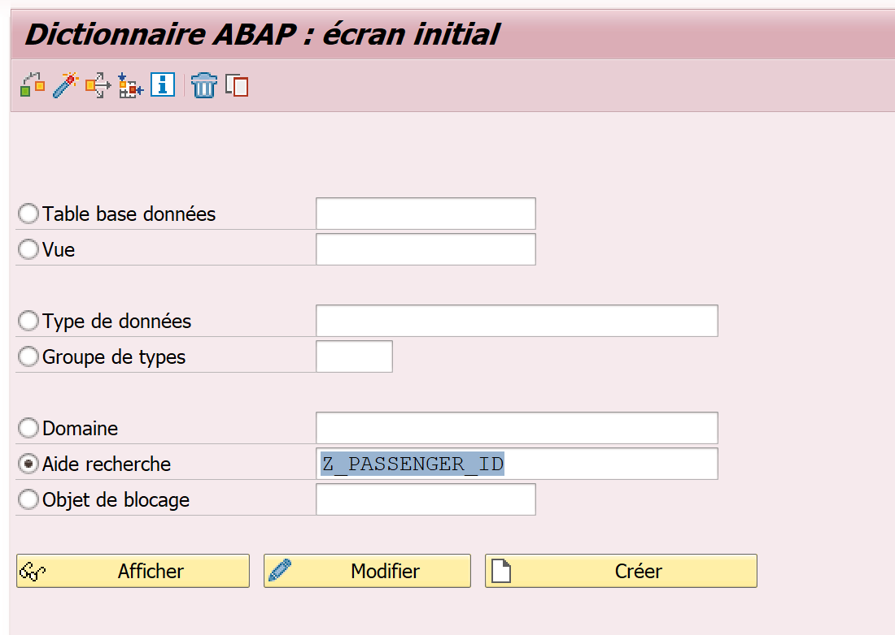
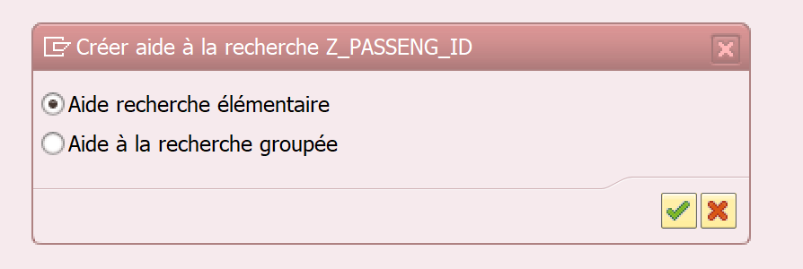
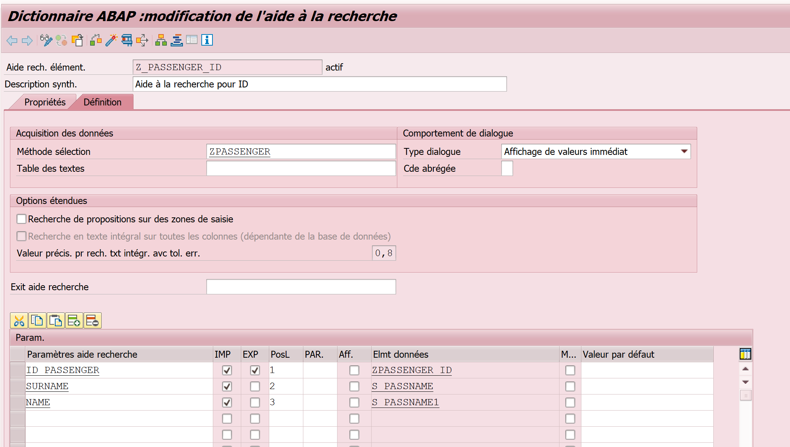
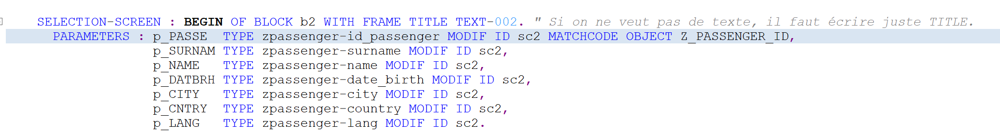
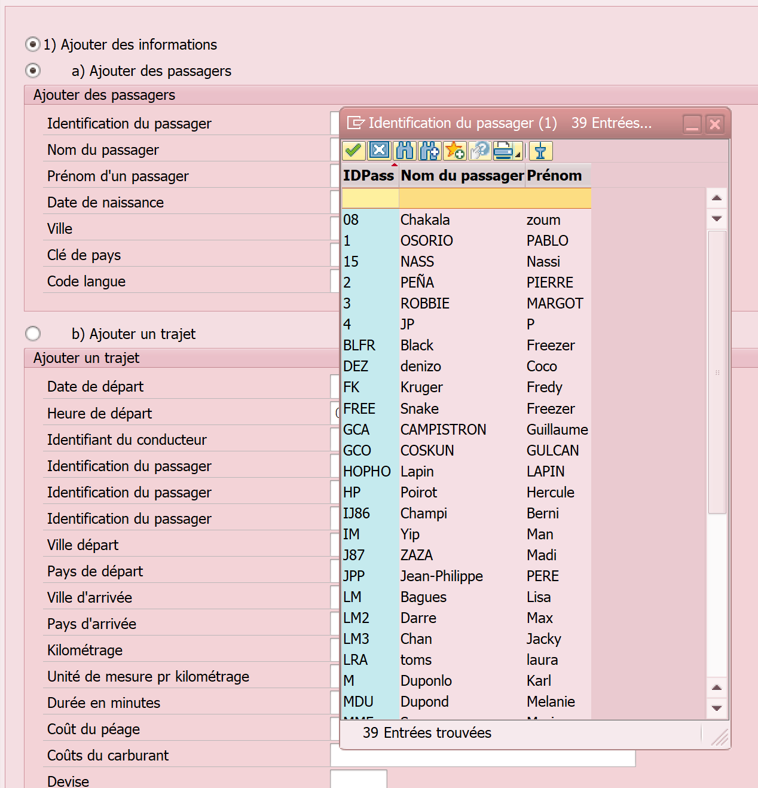

# MATCHCODE: *Aide à la recherche*

- Créer l'aide à la recherche
[SE11]



[Créer]



[Elementaire]

Pour le grouper on doit avoir créé plusieurs élémentaire (ca permet de regrouper quand ça vient de plusieurs tables)



Remplir "modèle de sélection"  avec le nom de la table et les paramètres d'aide à la recherche avec ce qu'on veut voir apparaitre. On coche import pour ceux qu'on veut afficher et export pour celui qu'on veut exporter.

On peut aussi dans table des textes mettre la table de la base de donnée (ex : MAKT) pour qu'il récupère automatiquement les textes.
Si le lien ne se fait pas, on peut rentrer du code dans le "EXIT"

Ajouter dans le code "matchcode objet" dans le screen avec le nom de l'aide à la recherche créé :



L'affichage final donnera ceci :




- Ou regarder la table en [SE11] et récupérer l'aide à la saisie du champs dans l'onglet [aide/contrôle saisie]

```ABAP
PARAMETERS : p_VBELN TYPE vbeln MATCHCODE OBJECT F4_VBAK.
```

- Ou au lieu de typer avec l'élément de donner, on type avec le nom de la table + element de donnée

```ABAP
PARAMETERS : p_VBELN TYPE vbak-vbeln.
```