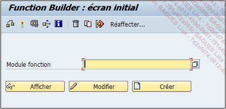

# Type de fonction 

La fonction ou plus exactement le module fonction est un outil indispensable à la programmation. En effet, il permet d’isoler un traitement spécifique (conversion, récupération d’informations, gestion de données...).

L’éditeur de gestion des fonctions se fait via la transaction SE37. Comme il a été évoqué dans le chapitre Premiers pas sur SAP - Connexion et fenêtre d’accueil, il est possible d’y accéder par ces différents moyens :

Depuis n’importe quel écran, en renseignant la transaction dans la zone de commande et en spécifiant si elle doit être exécutée dans une même session (/nSE37) ou dans une nouvelle (/oSE37).

À partir de la fenêtre d’accueil, dans le menu SAP par un double clic sur la ligne Function Builder (éditeur de fonctions) ou par un clic droit puis Exécuter : Function Builder.

[Menu SAP] - [Outils] - [ABAP Workbench] - [Développement] - [SE37 Function Builder]


L’écran d’accueil de la gestion du module fonction est assez sobre avec un champ pour renseigner la fonction et les trois boutons pour Afficher, Modifier ou Créer.

Module Fonction - Afficher [F7]

Module Fonction - Modifier [F6]

Module Fonction - Créer [F5]



La barre d’outils également n’a pas de grandes nouveautés avec (de gauche à droite) :

Contrôler

Module Fonction - Contrôler - Syntaxe [Ctrl][F2]

Activer

Module Fonction - Activer [Ctrl][F3]

Tester/Exécuter

Module Fonction - Exécuter - Dans l’environnement de test [F8]

Cas d’emploi

Utilitaires - Cas d’emploi [Ctrl][Shift][F3]

Manuel en ligne

Saut - Manuel en ligne [Ctrl][F8]

Supprimer

Module Fonction - Autres fonctions - Supprimer [Shift][F2]

Copier...

Module Fonction - Autres fonctions - Copier... [Ctrl][F5]

Renommer...

Module Fonction - Autres fonctions - Renommer... [Ctrl][F6]

Réaffecter...

Module Fonction - Autres fonctions - Réaffecter... [Ctrl][F7]

Cette dernière fonctionnalité permet d’affecter un nouveau groupe de fonctions au module. Pour comprendre cette notion, il est nécessaire d’avancer un peu dans ce chapitre.

Tout d’abord, il serait intéressant de reprendre l’exemple cité dans le chapitre Dictionnaire de données (DDIC) - Les domaines, où il a été vu qu’une routine de conversion pouvait être spécifiée pour un domaine.


En double cliquant dessus, plusieurs options de fonctions se sont présentées et l’exemple avec CONVERSION_EXIT_MATN1_INPUT avait été choisi.


De retour à l’écran d’accueil de la SE37, la fonction citée précédemment est donc choisie et renseignée dans le champ approprié.


En cliquant sur Afficher, le détail du module fonction s’affiche.


Là encore, il n’y a pas de nouveauté dans la barre d’outils, en effet, elle est exactement la même que celle de l’éditeur ABAP (cf. chapitre Premiers pas sur SAP - ’Hello World’) avec une petite différence pour les fonctionnalités suivantes :


Motif était présenté avec le titre Modèle dans la barre d’outils de l’éditeur ABAP. Ceci est une aide pour certains objets ABAP (fonction, méthode d’une classe...) pour afficher les paramètres obligatoires ou facultatifs, d’entrée, de sortie, de tables...

Documentation de module fonction est une documentation associée à l’utilisation de la fonction, de son rôle...

Entre les boutons Motif et Documentation apparaissent cinq autres boutons, qui existent également pour les programmes de l’éditeur ABAP, mais uniquement dans le cas de modules fonction ou programmes standards, car ils permettent de modifier le code source en insérant des balises et donc de documenter et suivre toute modification effectuée dans le code ABAP.

Synthèse des modifications liste toutes les altérations spécifiques effectuées sur le standard.

Insérer ajoute une ligne de code pour modification.

Remplacer troque la ligne sélectionnée par une autre.

Supprimer une ligne.

Annuler annule les dernières modifications effectuées.

Cependant, même ainsi les boutons restent grisés et impossibles à sélectionner, car il est nécessaire d’avoir la clé de l’objet pour pouvoir le modifier. La clé d’un objet est une sécurité de SAP pour éviter la modification de tous les objets standards.


De retour au module fonction, en cliquant sur le bouton Afficher liste d’objets images/08RI10.png, un volet dans la partie gauche de l’écran va lister tous les objets associés au module fonctions. C’est ici que le groupe de fonctions est défini.
Pour l’exemple de la fonction CONVERSION_EXIT_MATN1_INPUT, le groupe fonction associé est OMCV et on peut voir que d’autres fonctions font partie de ce groupe. On peut également constater que ce groupe de fonctions contient des Includes, des Points d’extension (ou Enhancement Point)...


Un groupe de fonctions n’est ni plus ni moins qu’un programme ABAP central de type F (cf. chapitre Premiers pas sur SAP - ’Hello World’) possédant plusieurs objets techniques. Ainsi, dans l’écran d’accueil de la transaction SE37, il est possible de modifier le groupe de fonctions affecté à une fonction et lui en attribuer un autre grâce au bouton Réaffecter.

Pour revenir à l’éditeur du module fonction, il est possible de voir qu’il dispose de sept onglets. Le premier concerne comme d’habitude les Propriétés de la fonction, mais cette fois-ci il est nécessaire de s’y attarder un peu.


Tout d’abord, le groupe de fonctions est renseigné avec une brève description. Vient ensuite le type d’exécution définie par trois possibilités :

Module fonction normal

Module accessible à distance (appelé également RFC pour Remote Function Call) permettant donc d’appeler le module fonction à partir d’un autre système SAP (SAP Portal par exemple) ou même hors SAP en utilisant le langage C, Delphi...

Module de mise à jour

Pour cette dernière option, il est nécessaire de bien comprendre les étapes d’exécution d’un programme sur SAP.


Quand un utilisateur, un développeur, ou un fonctionnel se connecte sur un système de SAP (schématisé par l’écran avec l’icône du Sap Logon), et qu’il exécute un programme ou une transaction quelconque, une requête est envoyée à un Dispatcher (répartiteur en français) qui va sélectionner la tâche (plus souvent trouvée sous le terme anglais work process) à exécuter.

Work process est divisé en différents types :

Dialog Work Process : processus de travail par dialogue (sous-entendu dialogue utilisateur), qui exécute les tâches diverses de SAP (transactions, programmes...), c’est la tâche utilisée par défaut et plusieurs peuvent être lancés en même temps.

Update (mise à jour) : c’est la partie où les tables de la base de données sont mises à jour dans la base de données, une fois que le processus défini dans le Dialog Work Process est terminé.

Background (arrière-plan), est utilisé lorsqu’un programme, une transaction, doit être exécuté en arrière-plan.

Enqueue (file d’attente) est l’élément qui va permettre de bloquer les tables de la base de données avant mise à jour.

Spool est le processus qui va gérer les pools d’impression.


Certaines de ces tâches sont regroupées dans une LUW (Logical Unit of Work ou Unité Logique de Travail), comme par exemple dans le chapitre Les requêtes SQL, lorsque la table ZTRAVEL a été mise à jour via l’instruction UPDATE. Il s’est alors produit le processus suivant :


Cette unité logique a commencé au moment où le programme contenant la requête de modification de la table ZTRAVEL a été exécuté. Une fois le programme terminé (et surtout le processus Dialog Work Process), une deuxième tâche (ou Work Process, pour rappel), mais d’update cette fois-ci, est exécutée. La table ZTRAVEL est ensuite bloquée pour mise à jour (Enqueue), et quand cette dernière étape est terminée, l’unité logique peut se terminer et débloquer la table.

Cependant, certaines instructions peuvent générer un processus, comme avec la requête suivante, qui bloque l’entrée de la table afin d’effectuer une mise à jour.

```ABAP
SELECT SINGLE * FOR UPDATE FROM dtab...
```

Dans le chapitre Les requêtes SQL - Définition, un schéma expliquait comment se déroulait une requête SQL sur SAP. Il peut maintenant être complété car la partie ABAP/Interface base de données, fait en réalité partie du processus Dialog Work Process.


Pour revenir à la fonction, trois types la caractérisent, qui peuvent être définis ainsi :

Fonction Normal : exécutée dès qu’elle est appelée.


Accessible à distance ou RFC : la fonction est appelée par un système externe (SAP ou autre) et exécutée immédiatement.


Mise à jour : la fonction est appelée pendant le processus Dialog Work Process, mise en attente, et exécutée pendant le processus UPDATE.


Aussi pour les modules fonction de mise à jour, il existe plusieurs options :

Mise à jour immédiate : l’exécution du module fonction sera d’ordre prioritaire et peut être réexécuté en cas d’erreur.

Lancement immédiat - non reportable : l’exécution du module fonction sera d’ordre prioritaire, mais ne pourra pas être réexécutée en cas d’erreur.

Mise à jour différée : fonction exécutée comme priorité faible, mais avec possibilité de la relancer en cas d’erreur.

Collecte : la fonction n’est pas exécutée dans le processus d’UPDATE, mais par un programme comme RSM13005. Cette option est utile lorsqu’un module fonction travaille sur un gros volume de tables, plusieurs fois dans la journée. Ainsi, le programme tiers (planifié pour se lancer une fois par jour par exemple) regroupera toutes les exécutions des fonctions en une seule fois et facilitera le travail sur les bases de données.

L’onglet Propriétés regroupe d’autres informations telles que le package utilisé, le développeur qui a créé la fonction, celui qui l’a modifié, la date de la dernière modification... Il serait maintenant intéressant de voir les autres onglets, car ils regroupent les paramètres d’entrée et de sortie de la fonction, ainsi que le code source.