# Création d’une fonction

Dans cette mise en pratique, un module fonction sera créé pas à pas. Il s’agira d’une fonction RFC qui créera un nouveau conducteur dans la table de base de données ZDRIVER_CAR.

- Tout d’abord, il faut créer le groupe de fonctions. Pour ce faire, exécutez la transaction SE37.

- Dans le menu, choisissez l’option suivante :

[Saut] - [Gestion groupes de fonctions] - [Créer groupe]

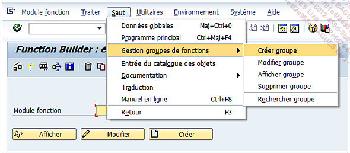

- Entrez le nom du groupe de fonctions comme par exemple ZCARPOOLING.

- Entrez une désignation comme ’Covoiturage’.

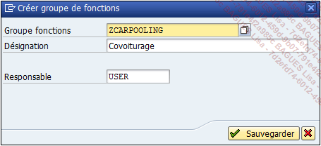

- Dans la nouvelle fenêtre, définissez l’objet en local ou, si vous le souhaitez, utilisez une classe de développement, puis un ordre de transport si besoin.

Une fois le groupe de fonctions créé comme indiqué dans la barre des messages en bas de l’écran, il faudra créer le module fonction.

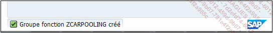

- Dans l’écran initial de la gestion de l’éditeur, renseignez le champ avec le nom de la fonction à créer (par exemple ZDRIVER_CREATE) puis appuyez sur le bouton Créer.

- Dans la fenêtre pop-up, entrez le nom du groupe de fonctions créé précédemment, puis une désignation.

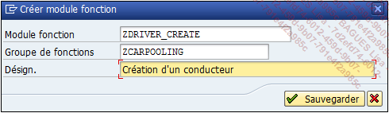

- Une fenêtre de warning peut apparaître, validez simplement pour passer à l’étape suivante.

- Allez dans l’onglet Propriétés.

- Comme il s’agit d’un module RFC et donc exécutable à distance, cochez l’option Module accessible à distance.

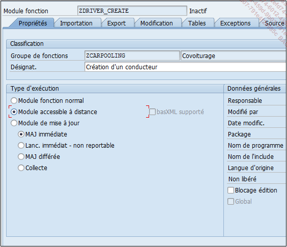

- Dans l’onglet Importation, nous allons avoir besoin d’une structure en entrée avec les informations nécessaires du conducteur et de son véhicule. Pour faciliter, il s’agira d’une structure utilisant la structure ZDRIVER_CAR comme référence. Aussi, comme il s’agit d’une fonction RFC, l’option Passage par valeur est obligatoire.

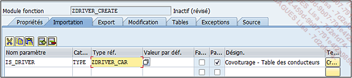

- Dans l’onglet Export, il y aura seulement le numéro d’identification à retourner (même si le champ est renseigné dans la structure en entrée, il ne sera pas pris en compte, car c’est la fonction qui devra en contrôler la numérotation). Le champ aura comme référence l’élément de données défini pour le champ DRIVER_ID de la table ZDRIVER_CAR. Là encore, comme il s’agit d’une fonction RFC, l’option Passage par valeur est obligatoire.

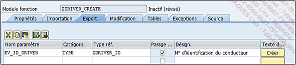

- Enfin, l’onglet Exceptions listera les erreurs rencontrées comme : le conducteur existe déjà, les informations concernant le conducteur sont incomplètes, les informations concernant le véhicule sont incomplètes.

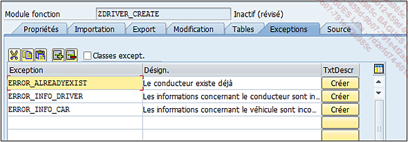

-Puis le programme sera développé selon l’algorithme suivant :

1. Vérifiez si les informations du conducteur sont renseignées sinon renvoyez l’exception ERROR_INFO_DRIVER à l’aide de l’instruction RAISE.

```ABAP
IF is_driver-surname    IS INITIAL OR 
   is_driver-name       IS INITIAL OR 
   is_driver-date_birth IS INITIAL OR 
   is_driver-city       IS INITIAL OR 
   is_driver-country    IS INITIAL. 
  RAISE error_info_driver. 
ENDIF.
```

2. Vérifiez que les informations du véhicule sont renseignées, sinon renvoyez l’exception ERROR_INFO_CAR.

```ABAP
IF is_driver-car_brand IS INITIAL OR 
   is_driver-car_model IS INITIAL OR 
   is_driver-car_year  IS INITIAL OR 
   is_driver-car_color IS INITIAL OR 
   is_driver-car_id    IS INITIAL. 
  RAISE error_info_car. 
ENDIF.
```

3. Vérifiez que le conducteur (nom et prénom) n’existe pas dans la table ZDRIVER_CAR, sinon renvoyez l’exception ERROR_ALREADYEXIST, ou mettre à jour la structure locale WA_DRIVER_CAR déclarée en début de programme.

```ABAP
DATA: wa_driver_car TYPE zdriver_car. 
 
... 
 
SELECT SINGLE id_driver FROM zdriver_car 
  INTO @DATA(v_id_driver) 
  WHERE surname = @is_driver-surname 
    AND name    = @is_driver-name. 
IF sy-subrc = 0. 
  RAISE error_alreadyexist. 
ELSE. 
  MOVE-CORRESPONDING is_driver TO wa_driver_car. 
ENDIF.
```
 
4. Importez le dernier numéro d’identifiant du conducteur dans la variable V_ID_DRIVER. Comme il s’agit d’un champ alphanumérique, il va falloir isoler le numéro (quatre positions à partir de la première position), le stocker dans la variable de type numérique V_NUM, l’incrémenter de 1 pour le réattribuer à la variable V_ID_DRIVER concaténée à la lettre C :

```ABAP
SELECT MAX( id_driver ) FROM zdriver_car 
  INTO @v_id_driver. 
 
v_num       = v_id_driver+1(4) + 1. 
CONCATENATE 'C' v_num INTO v_id_driver. 
CONDENSE v_id_driver NO-GAPS.
```

5. Mettez à jour le champ ID_DRIVER de la structure WA_DRIVER_CAR, puis utilisez l’instruction INSERT pour ajouter l’enregistrement à la table de la base de données ZDRIVER_CAR. Si tout s’est bien déroulé (variable système de code retour SY-SUBRC égal à 0), le paramètre de sortie EV_ID_DRIVER est mis à jour avec l’identifiant trouvé précédemment.

```ABAP
wa_driver_car-id_driver = v_id_driver. 
 
INSERT zdriver_car FROM wa_driver_car. 
IF sy-subrc = 0. 
  ev_id_driver = v_id_driver. 
ENDIF.
```

Il est possible de tester la fonction en cliquant sur le bouton Exécuter de la barre d’outils ou via le menu suivant :

Module fonction - Exécuter - Tests de module

L’écran de test s’affiche avec une barre d’outils comprenant les fonctionnalités suivantes :


Exécuter pour lancer le programme.

Modules fonction - Exécuter [F8]

Débogage pour exécuter le programme en mode debugger.

Modules fonction - Débogage [Ctrl][F7]

Sélectionner permet, après avoir sélectionné un paramètre d’entrée de la partie principale, d’en voir son contenu.

Traiter - Sélectionner [F2]

Répertoire des données de test liste les cas de test sauvegardés grâce au bouton de sauvegarde de la barre de commande (ou Traiter - Sauvegarder enregistrement de données [Ctrl] S).

Saut - Répertoire des données de test [Ctrl][Shift][F6]

Dans la partie principale de l’écran sont listés les paramètres de la fonction.

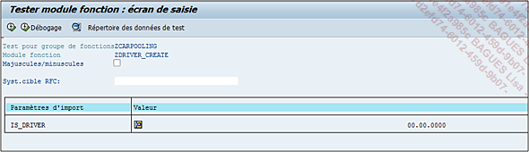

Pour cet exemple, il n’y aura que IS_DRIVER. Il suffira alors de cliquer sur l’icône Vue détaillée/Traiter pour remplir les champs de la structure.

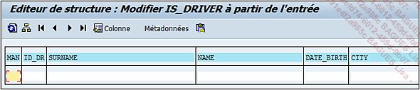

Une fois les champs renseignés, il faudra revenir en arrière avec le bouton Retour de la barre de commande. Puis, avec le bouton Exécuter, la fonction sera lancée et le résultat affiché avec le paramètre de sortie renseigné, la durée d’exécution...

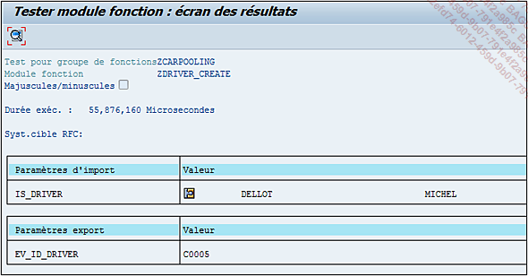
Maintenant que la création d’un module fonction a été détaillée, il serait intéressant que vous fassiez l’exercice qui suit, pour vérifier que vous avez bien assimilé cette dernière partie.

Il est possible de retrouver le code de ce programme dans le fichier 08_CODE_02.txt.