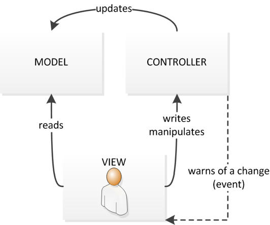
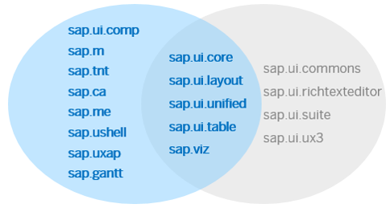
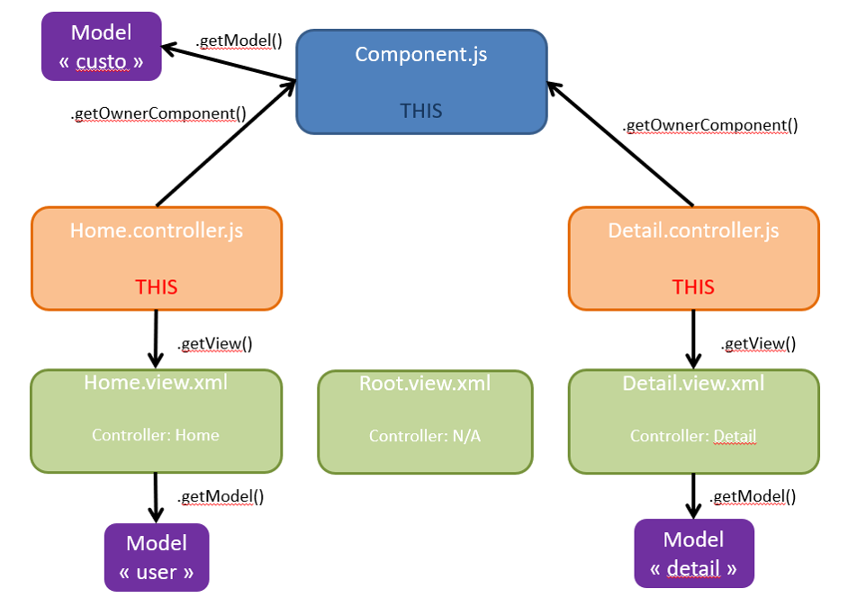
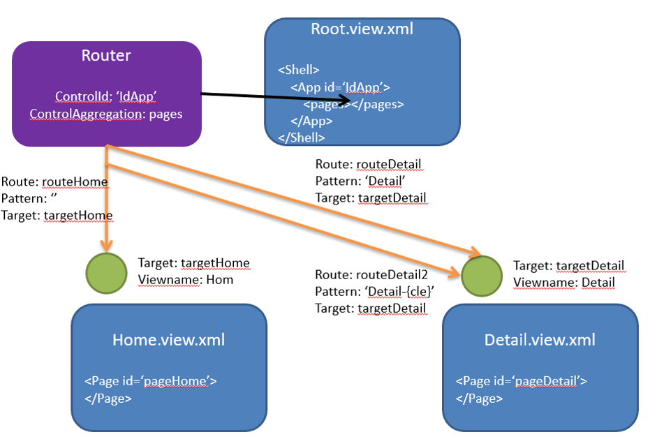
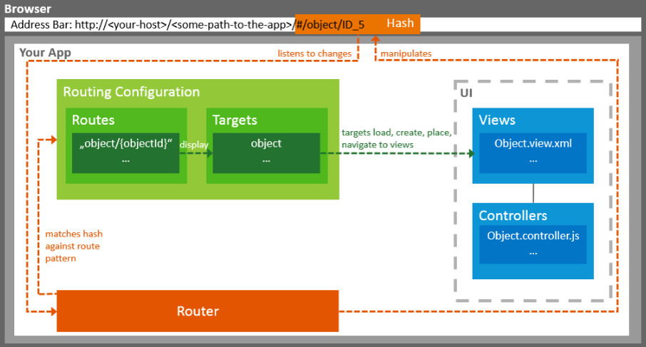

# SAP UI5: *p.15*

Support de cours : [Formation - SAPUI5 FIORI.pptx]

>Framework SAP regroupe:
- Un Core permettant de faire fonctionner une application
- Une librairie UI5 d’éléments préconstruits
- Repose sur HTML5, Javascript et JQuery

>Motif d’architecture MVC:
- Modèle
- Vue
- Contrôleur



## 2 types de vues principalement utilisées

>XML:

Type le plus utilisé
Syntaxe XML
Définir les namespaces des librairies UI5 utilisées

>JS:

Type javascript
Liens entre les contrôles gérer par du code

Il existe également des vue HTML et JSON, ce type de vue modifie la syntaxe uniquement. Le rendu sera le même à l’exécution

## Les contrôles

Les contrôles UI5 sont organisés dans des librairies par famille.
Une application utilise plusieurs ensembles de contrôles de librairies différentes



Liste des contrôles SAP UI5:
https://sapui5.hana.ondemand.com/#/api

Un contrôle est un objet javascript, constitué de propriétés, de méthodes et d’évènements

Un contrôle peut agréger d’autres contrôles

### - 2 types de contrôleurs

>Un contrôleur d’application:

- Contrôleur principal
- Accessible par chaque vue de l’application

>Contrôleurs de vue:

- 1 vue <=> 1 contrôleur
- Le contrôleur de vue est accessible seulement par la vue liée

Tous les contrôleurs sont codés en javascript

>Chaque contrôleur invoque les méthodes suivantes:

- onInit(): appelée lorsque la vue est instanciée (le JavaScript va être appelé)
- onExit(): appelée lorsque la vue est détruite (fermeture de l'application)
- onAfterRendering(): appelée après que la vue a été transformée en HTML5 (rendering) (transformer le XML en Html)
- onBeforeRendering(): appelée avant que la vue soit transformée en HTML5 (ne fonctionne pas à la première transformation)



### - Extension d'un contrôle

SAP UI5 possède un mécanisme d’extensibilité

Il est possible d’étendre des contrôles, des types ou des élements

Chaque contrôle possède la méthode renderer() qui permet de transformer le contenu en HTML5

Chaque objet SAP UI5 possède une méthode extend() permettant de définir 1 nouveau contrôle qui héritera du contrôle de base.  En plus, il est possible d’ajouter des métadonnées (propriétés, agrégations, évènements) 

## CSS

La disposition des éléments à l’écran ainsi que leur apparence se gère au niveau du CSS

On ajoute des classes au fichier css qui seront affectés aux Contrôles au niveau de la vue XML

Le CSS permet une gestion responsive de l’application
On peut variabiliser le contenu CSS à la taille de l’écran

Possible d’utiliser des packages de contenu CSS déjà configuré (ex: bootstrap)

Attention pour une application du Launchpad, SAP préconise de garder le thème SAP.

## Modèle

>OData:
- Modèle côté serveur (données provenant d’un serveur)
- Permet de lier des contrôles UI5 aux service OData


>JSON:
- Modèle côté client
- Permet de lier des contrôles UI5 aux objets javascript


>Resource:
- Modèle de type clé-valeur, utilisé pour les textes (traductions)

Il est possible de multiplier le type et le nombre de modèle dans une même application

Une application doit être disponibles en plusieurs langues. 
La sélection de la langue dépend de la langue par défaut du navigateur ou de l’appareil.

S’appuie sur le resource model
Un fichier par langue sous format « i18n_<Langue>.properties »

2 notations, par code ou XML
- XML: {i18n>Texte}
- Javascript:

```JS
var oModel = new sap.ui.model.resource.ResourceModel({bundleName: "i18n",locale: "en"});
var oBundle = oModel.getResourceBundle();
oBundle.getText("clé", [paramètres] );
```
L’application va aller chercher les fichiers de langue par ordre de priorité et va s’arrêter une fois trouvé:
- Langue de connexion
- Anglais
- Défaut

S'il manque la traduction, il va chercher la traduction par défaut.


## Les binding

Le binding est un concept permettant de mettre en relation un élément du modèle et un contrôle


Le binding peut se faire en ligne de code ou en notation dans l’XML


Il y a deux types de binding mais leur fonctionnement reste identique

- Binding de propriété: on va mapper une propriété du modèle à un contrôle
```JS
var oControl = new sap.m.Text({
	text: ‘{modelProperty}‘
});
```

- Binding d’agrégation: on va mapper une liste d’éléments du modèle (exemple dans le cas d’une liste ou d’un tableau)
```JS
var oItemTemplate = new ListItem({text: ‘{AggProperty}'});
var oComboBox = new ComboBox({
	items: { path: ‘/modelAggregation', template: oItemTemplate }
});
```

## Tris et filtres

Les contrôles regroupant des collections (listes, tables…) peuvent être triés ou filtrées.


Les filtres et tris appliqués sur un contrôle UI5 engendre un filtre et tri sur l’OData utilisé.


Notation avec sorter et filter
```JS
<Table rows="{ path: '/Employees',
		 sorter:[{ path: 'LastName',
		 	     descending: false}],		                               	       filters:[{ path: 'FirstName',
		            operator: 'EQ',
                      value1: 'Julien'}]	
		 }" >
```

## Route et Target

La navigation entre les pages d’une application se fait par le biais du Router


Le Router :
- S’initialise au niveau du Component.js
- Se paramètre au travers du Manifest.json
- Accessible dans toutes les vues via getOwnerComponent()


Une target pointe sur une vue de l’application
Une route pointe sur une target


Il est possible d’avoir plusieurs routes sur une target




## Formatter

Il est possible de formatter les données pour l’affichage (exemple une date: JJ/MM/AAAA ou Jour JJ Mois AAAA …)

Cette technique s’appuie sur un contrôleur global à l’application (Formatter.js)

Ce contrôleur doit être déclaré dans chaque contrôleur de vue pour être disponible

```JS
<Text text="{path: '/text', formatter: '.formatter.upperCase'}" />

var oText = new sap.m.Text({
	text: {
		path: '/text ',
		formatter: this.formatter.upperCase
	}
});
```

## Portal *p.35*


## DANS SAP

Transaction [SEGW] : pour voir les détails dans SAP

Dans Entity types : propriétés :

Cocher "sorttable" si on veut qu'ensuite la table ûisse être filtrer dans fiori

Cocher "nullable" si on a besoin d'une date dans le champs

Dans Runtime artifacts : (coeur des échanges entre fiori et sap)
Pour les classes / methodes qui seront utilisés.
Utiliser que ceux où il y a marqué EXT

Cliq droit sur la classe pour voir sur ABAP workbench

Methode *widen_range* : permet de rajouter les étoiles avant et après la recherche pour faire une recherche plus large


Pour débugger dans SAP, il faut le faire avec l'utilisateur *TEST_FIORI*

[Utilitaire]
[Option]
[Debugger]
Utilitaire : changer par : TEST_FIORI


## EXERCICE

Aide : https://sapui5.hana.ondemand.com/#/api


1- Ajouter les textes de traduction (i18n)

_Dans i18n.properties_ et rajouter en fin de code :

```xml
personne.title= Personnes
personne.Id= Identifiant
personne.Title= Mr/Mme
personne.Firstname= Prénom
personne.Name= Nom
```

2- Ajouter un filtre pour le nom de famille

_Dans List.view :_

```xml
<smbar:controlConfiguration>
	<smbar:ControlConfiguration index="0" key="Firstname" label="{i18n>filter.Firstname}" visibleInAdvancedArea="true" hasTypeAhead="false"/>												
</smbar:controlConfiguration>
 <smbar:controlConfiguration>
	<smbar:ControlConfiguration index="1" key="Lastname" label="{i18n>filter.Lastname}" visibleInAdvancedArea="true" hasTypeAhead="false"/>												
</smbar:controlConfiguration>
```

Vérifier que le filtre avait bien été fait en back end.


3- Ajouter des indicateurs de statut inactif 

4- Fusionner les colonnes Title/Firstname/Lastname en une seule

5- Afficher le libellé des compétences d'une personne 

6- Ajouter un champ téléphone
