# FIORI: *Portal*

*Service Portal*
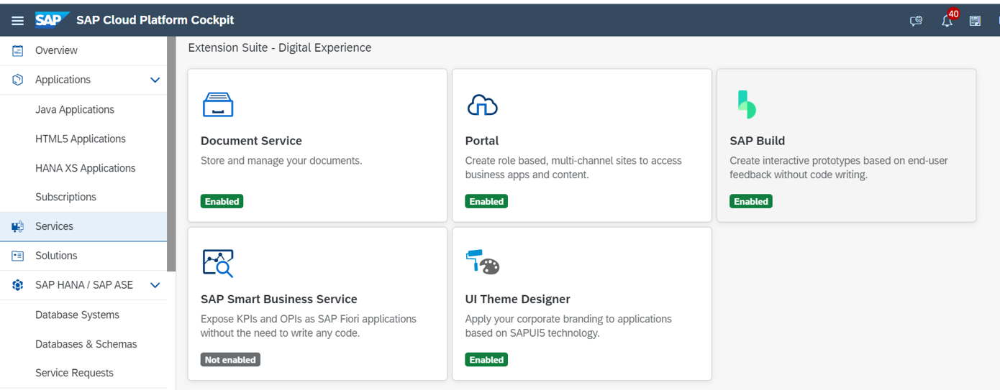

*Configure Portal*
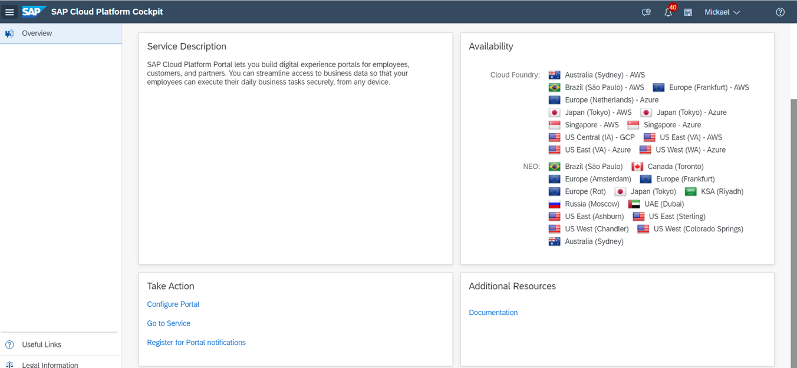

*Destinations*

Déclaration des destinations utilisées depuis le service portal
	Ex: Odata Provisioning pour données tuiles dynamiques

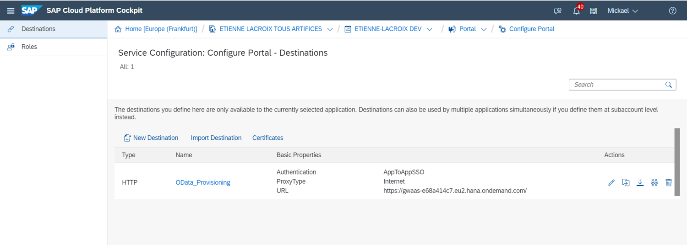

*Rôles*

Définition des rôles utilisés dans le launchpad en lien avec la partie Security – Authorizations (affectation de groupes, utilisateurs)
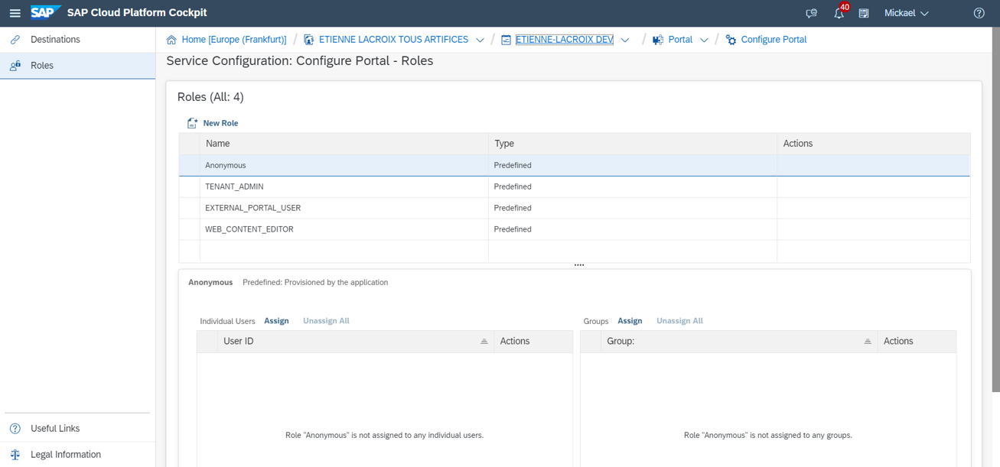

Administration des portails Launchpad

*Création d’un site*
Possibilité de créer des sites rapidement
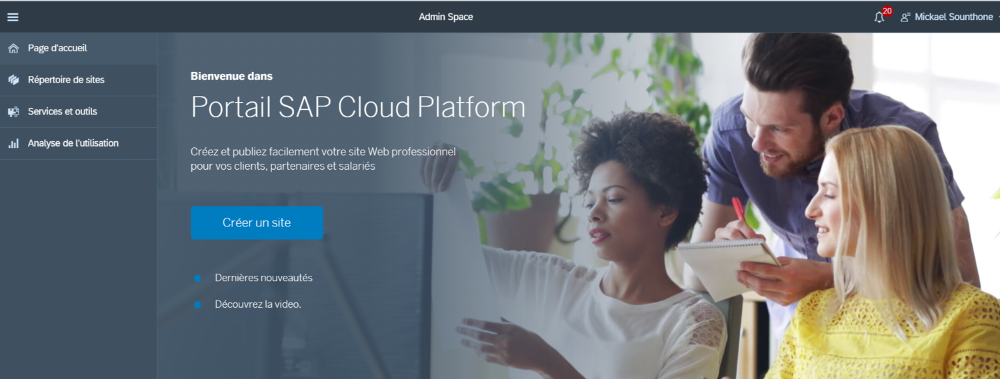

*Création d’un site*

Il existe différents types de modèles:
Site d’administration
Fiori Launchpad
Site marketing 
…
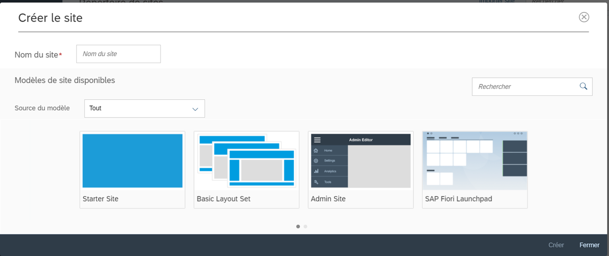

*Répertoire de sites:*

Permet de voir l’ensemble des sites créés
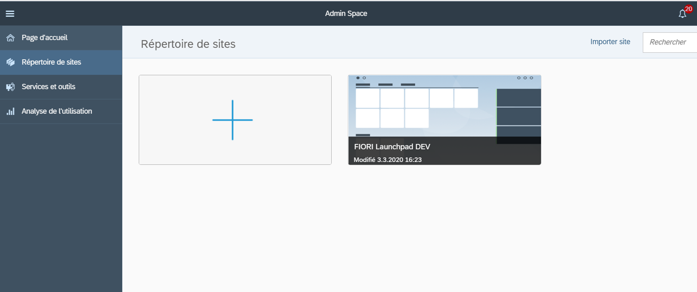

*Service et outils*

Gestion des mentions légales

Activation gestion de la confidentialité des données d’utilisation 
(permet analyse de l’utilisation (statistiques…))
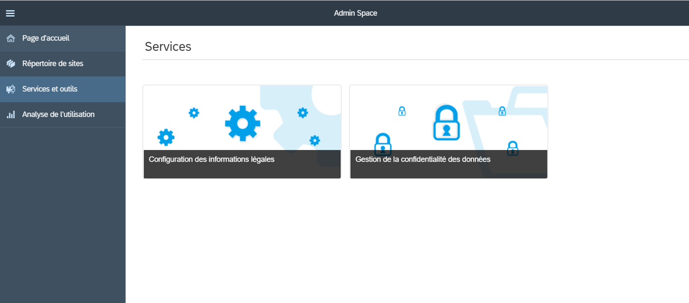

*Analyse de l’utilisation*

Permet d’accéder à des statistiques d’utilisation des différents sites
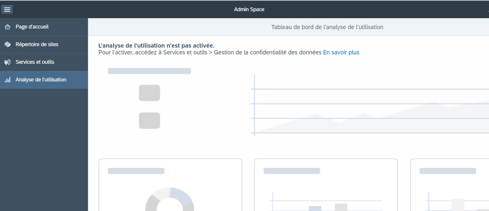

*Paramétrage d’un site Fiori Launchpad*
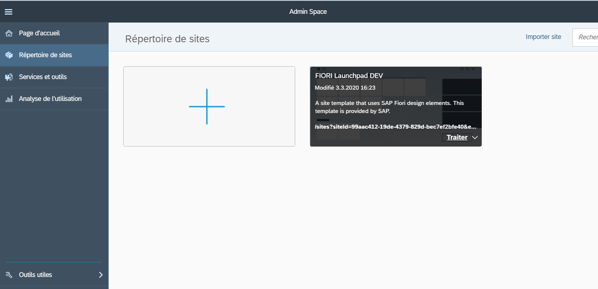

*Options du site Fiori Launchpad*
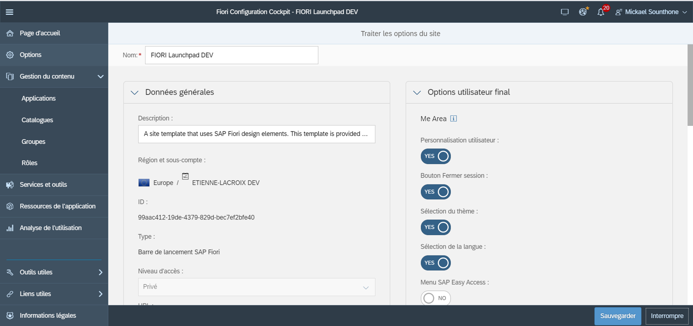

*Services et outils du site Fiori Launchpad*
- Traductions
- Thèmes
- Import/export
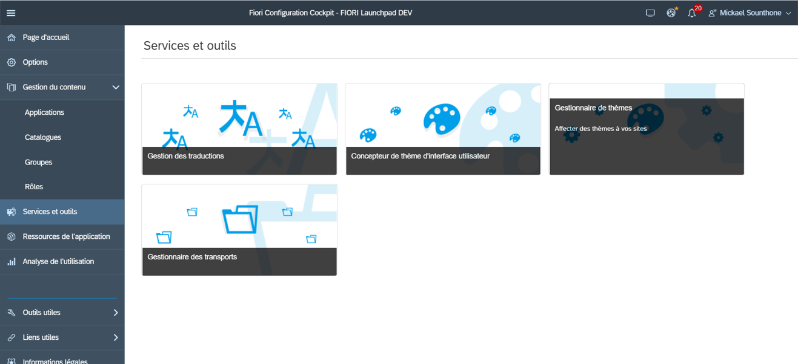

*Ressources du site Fiori Launchpad*
- Applications
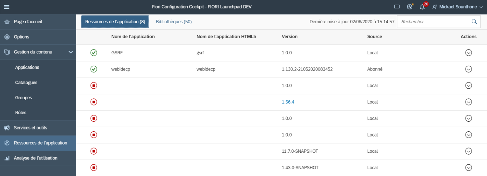

*Analyse de l’utilisation*
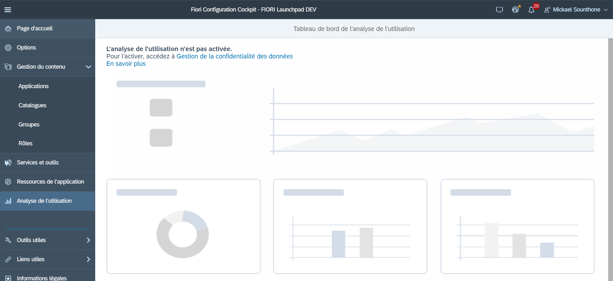

*Gestion du contenu*
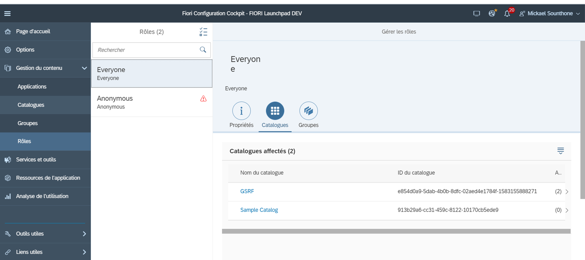

*Rôles*
- Il est d’usage de créer les rôles en fonction du métier des utilisateurs

*Applications*
- Paramétrage des applications utilisées dans le site (Titre, sous titre, icône…)

*Catalogues*
- C’est un ensemble d’applications que l’on veut mettre à disposition pour un rôle donné. L’utilisateur peut alors choisir les applications qu’il veut avoir dans sa page d’accueil depuis les catalogues dont il a accès.

*Groupes*
- C’est un sous ensemble d’applications provenant d’un ou plusieurs catalogue(s) qui est affiché sur la page d’accueil. L’utilisateur peut customiser les applications des groupes prédéfinis (ajout ou retrait) ou créer des groupes propres à l’utilisateur.  

*Rôles*
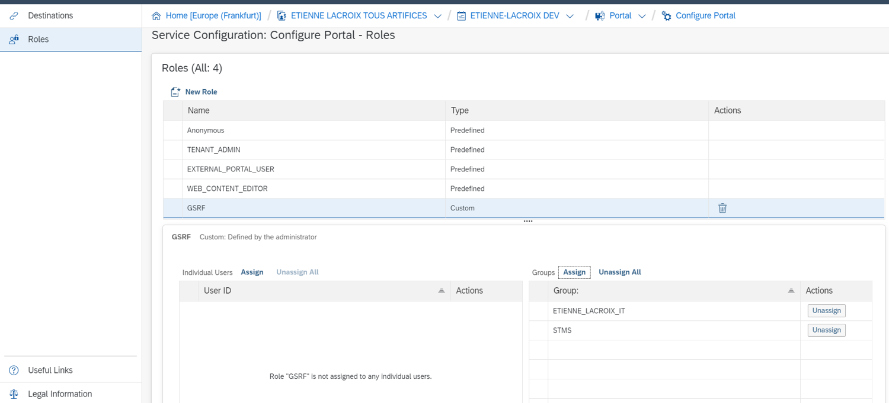

*Rôles*
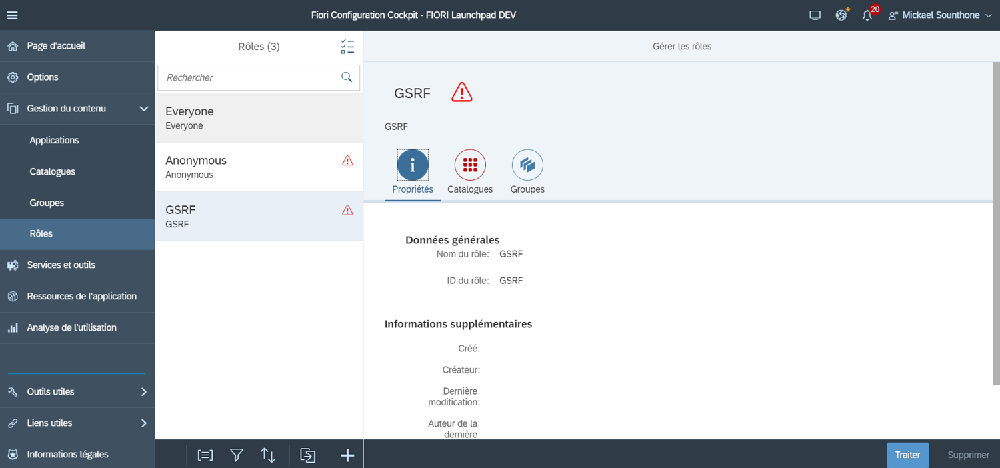

*Applications*
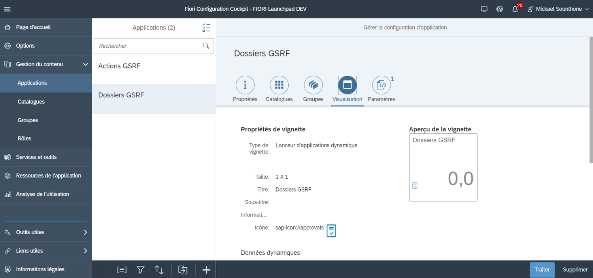

*Applications*
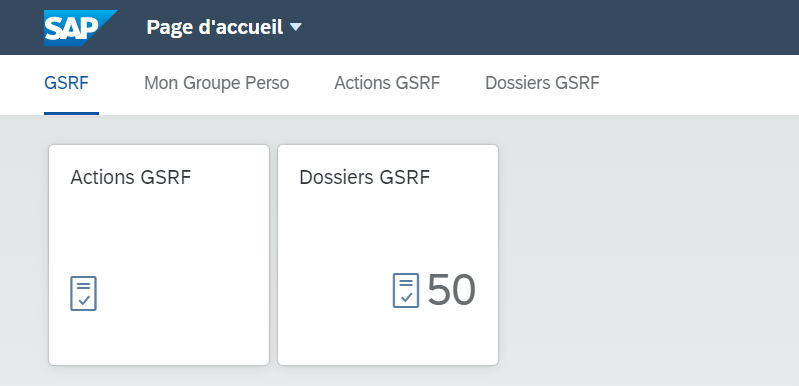

*Catalogues*
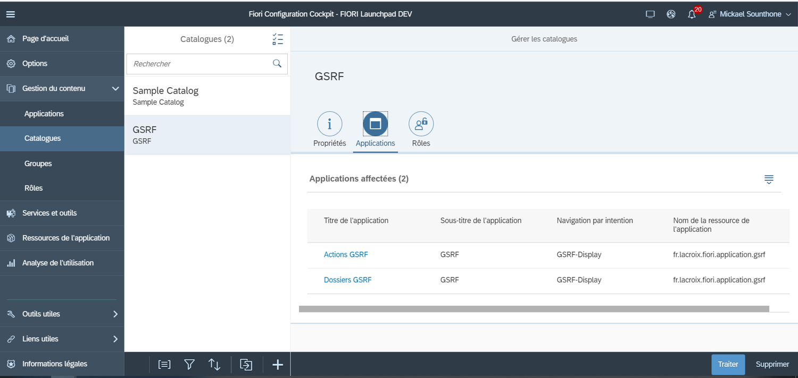

*Catalogues*
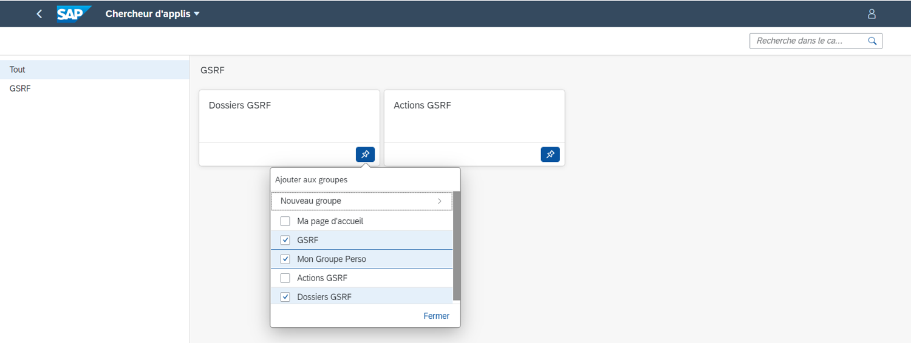

*Groupes*
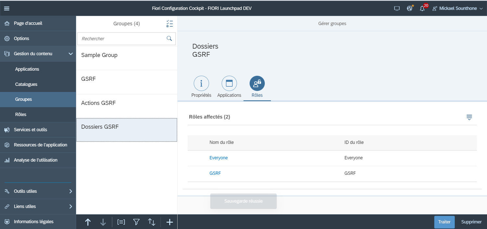

*Groupes*
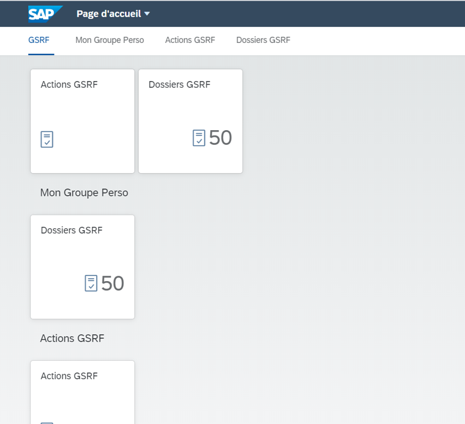

*Groupes*
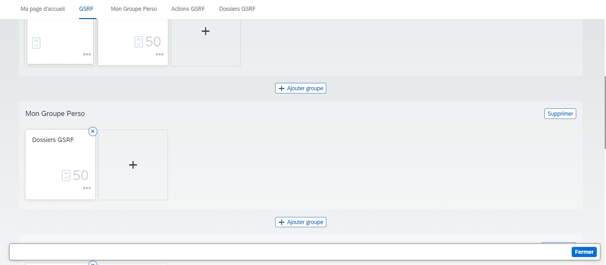

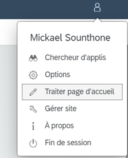
## ANNEXES

*SAP UI5:*
https://sapui5.hana.ondemand.com/#/topic

*Techno Web - Tuto:*
https://www.w3schools.com/

*CSS Generator:*
http://css3generator.com/

*Outils SAP:*
https://wiki.scn.sap.com/wiki/display/SWI/SAP+Web+IDE+Personal+Edition

*SAP UI5 icones:*
https://sapui5.hana.ondemand.com/test-resources/sap/m/demokit/iconExplorer/webapp/index.html

*Couleurs:*
http://paletton.com/#uid=1000u0kllllaFw0g0qFqFg0w0aF

*CSS Code:*
https://www.sassmeister.com/

